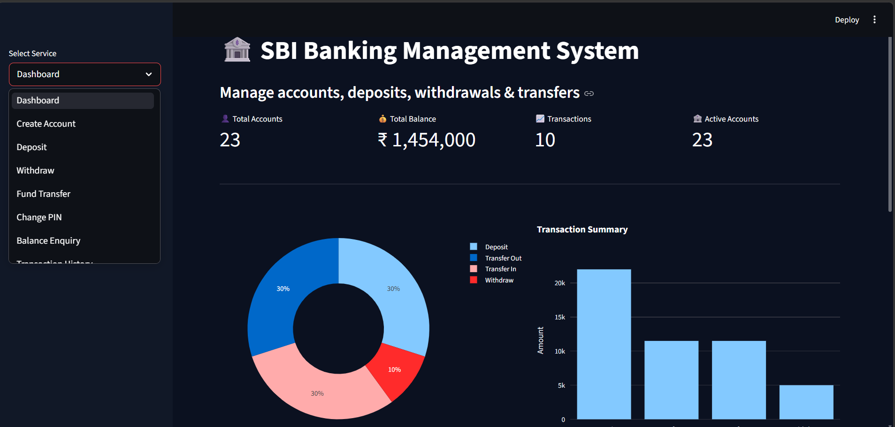
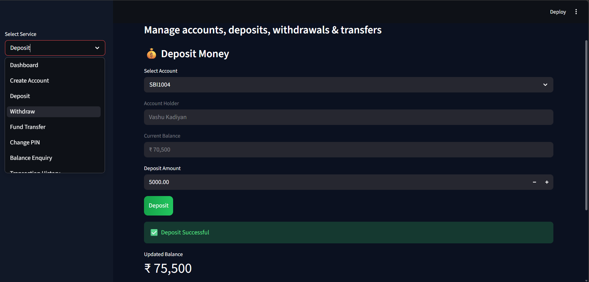

# 🏦 SBI Banking Management System

<p align="center">


</p>

---

## 📌 Project Overview

🏦 **SBI Banking Management System** is a full-featured banking simulation web application built using **Python, Streamlit, Pandas, and Plotly**.

It simulates real-world banking operations like:
- Account creation  
- Deposits & withdrawals  
- Fund transfers  
- Transaction analytics dashboard  

---

## ✨ Features

### 👤 Account Management
- Create New Account  
- Change PIN  
- Balance Enquiry  

### 💰 Banking Operations
- Deposit Money  
- Withdraw Money  
- Fund Transfer  

### 📊 Analytics Dashboard
- Total Accounts  
- Total Balance  
- Total Transactions  
- Transaction Pie Chart  
- Transaction Bar Chart  

### 📜 Transaction Services
- View Transaction History  
- Download Statement (CSV)  

---

## 🛠️ Tech Stack

| Technology | Purpose |
|------------|--------|
| Python | Backend Logic |
| Streamlit | Web App |
| Pandas | Data Handling |
| Plotly | Visualization |
| CSV Files | Storage |
| Git & GitHub | Version Control |

---

## 📂 Project Structure


sbi-banking-app/
│
├── app.py
├── bank.csv
├── transactions.csv
├── requirements.txt
├── README.md
└── assets/
├── dashboard.png
├── deposit.png
├── withdraw.png
├── transfer.png
└── history.png


---

## 📸 Screenshots

### 🏠 Dashboard


### 💰 Deposit Page


### 💸 Withdraw Page


### 🔁 Fund Transfer


### 📜 Transaction History


---

## 🚀 Installation & Run

```bash
git clone https://github.com/Kanu-Bansal/sbi-banking-app.git
cd sbi-banking-app
pip install -r requirements.txt
streamlit run app.py
👩‍💻 Author

Kanika Chauhan

GitHub: https://github.com/Kanu-Bansal

🎯 Aspiring Data Analyst | Python Developer | Streamlit Enthusiast

⭐ Support

⭐ Star this repo
🍴 Fork it
📢 Share it